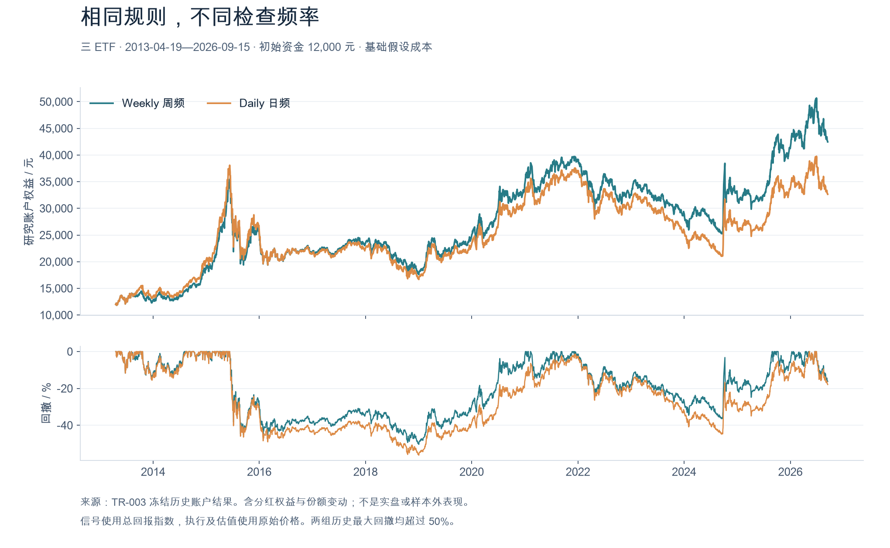
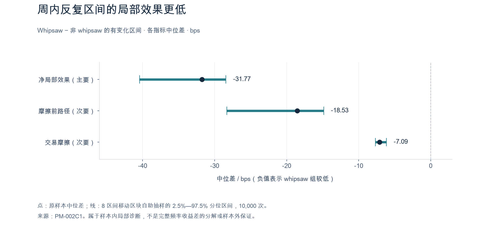

# A 股 ETF 量化研究

### 交易频率、交易摩擦与研究验证

围绕 A 股 ETF 的数据处理、动量规则和模拟账户开展量化研究。项目从周线波段模拟系统起步，逐步将重点扩展到：**比较规则在什么条件下有效、结果为何变化，以及哪些结论仍需要新数据检验。**

当前重点案例是在相同规则下比较日频与周频检查，并结合分红、份额变动、执行成本及局部反事实分析，研究周内目标反复的影响。

**展示更新：2026-10-04。** 历史研究样本截止 2026-09-15。近期代码和运行材料仍在本地持续更新，本次优先整理研究展示与证据；完整代码同步和下载复现入口后续整理。

| 阅读入口 | 内容 |
| --- | --- |
| [项目与研究路径](docs/showcase/research-overview.md) | 研究对象、系统结构与问题推进 |
| [主案例：日频与周频动量比较](docs/showcase/daily-vs-weekly.md) | 实验规则、历史结果、局部机制与统计检查 |
| [数据与方法](docs/showcase/data-and-methods.md) | 价格口径、公司行动、执行及权益核对 |
| [当前进展与限制](docs/showcase/project-status.md) | 历史研究、工程验证与前瞻观察的区别 |
| [研究工作流与 AI 协作](docs/showcase/contributions.md) | 实现方式与贡献说明边界 |
| [证据索引](docs/showcase/evidence/README.md) | 本次展示引用的原报告、摘要与来源哈希 |

## 正在研究的问题

相同的 ETF 动量规则，每天检查与每周检查会产生怎样的账户路径差异？更高的检查频率是否引入更多目标反复和交易摩擦？观察到的差异在原样本内是否稳定，又能否在规则冻结后的新数据中保持？

主案例只研究 **510300、510500、159915** 三只 ETF。更广的 ETF 数据与系统模块属于项目背景，不等于本案例扩大了研究 Universe。

## 历史比较：频率改变了什么

共同研究期为 **2013-04-19 至 2026-09-15**，初始资金 12,000 元。两组均按 20 个实际交易观察日的总回报动量选择 Top2；仅检查频率不同。名单发生变化时，两只 ETF 各以信号日收盘研究权益的 45% 冻结目标金额，下一实际交易日按原始开盘价与假设成本执行。

| 基础成本情景 | 日频 Daily | 周频 Weekly |
| --- | ---: | ---: |
| 最终研究权益 | 32,637.51 元 | 42,461.21 元 |
| 累计净收益 | +171.9792% | +253.8434% |
| 最大回撤 | −56.2332% | −50.3786% |
| 目标事件（含首次建仓） | 461 | 205 |
| 已成交订单 | 1,015 | 484 |
| 假设总交易成本 | 8,260.54 元 | 3,932.76 元 |

**这些是指定样本、规则及假设成本下的历史研究结果。** 本实验主要比较检查频率，并未据此证明相对市场基准的 Alpha；两组均有较大历史回撤，也尚无前瞻样本外表现。成本压力情景及口径详见[完整案例](docs/showcase/daily-vs-weekly.md)。

来源：[含分红的历史回放报告](docs/showcase/evidence/res_freq_tr_003_screen_2026-09-26.md)。

## 从结果比较继续追问机制

687 个完整周区间中，111 个出现目标集合返回此前状态的周内反复（whipsaw，占 16.16%）。为区分持仓路径与交易摩擦，研究从每个区间相同的 Daily 实际账户状态出发，分别重放实际动态换仓、保持持仓及复制相同成交数量的无摩擦路径。

在原样本中，whipsaw 区间相对其他有目标变化区间的净局部效果中位数低 **31.77 bps**。预定的区块自助抽样与逐一区间移除检查均保持负方向。

这里的局部反事实每个区间都重新从共同状态开始，**不能相加解释完整 Weekly − Daily 的终值差**。统计检查属于冻结历史样本内机制分析，不构成未来收益保证或新交易规则。

来源：[局部反事实报告](docs/showcase/evidence/res_freq_pm_002b_pnl_attribution_2026-09-27.md)、[样本内稳健性报告](docs/showcase/evidence/res_freq_pm_002c1_robustness_2026-09-28.md)。

## 研究如何组织

项目保留原报告、数值摘要和不支持假设的结果。另一个研究案例中，风险调整动量未在冻结条件下证明相对简单 RET20 的增量优势，因此保留了不予推进的判断。[查看 P2 研究报告](docs/showcase/evidence/p2_risk_adjusted_momentum_robustness_2026-07-19_report.md)。

## 当前进度

| 层面 | 截至 2026-10-04 的状态 |
| --- | --- |
| 历史频率比较 | 已形成含分红、份额变动与假设成本的四情景回放证据 |
| 机制分析 | 已完成描述诊断、局部反事实与样本内统计检查 |
| 前瞻协议 | TEWM-v1 已冻结；Weekly 候选与 Daily 比较账户共用规则 |
| 信号与执行工程 | 合成验收记录为 132/132 通过，包含中断恢复及对账检查 |
| 真实前瞻记录 | Weekly 信号 0、Daily 信号 0、执行 0；账户尚未启动 |

研究以公开或授权数据和模拟账户为基础。当前展示不表示正式交易权限或实盘准备完成；项目不连接券商、不真实下单。工程测试的通过也不代表策略有效性。[查看状态和限制](docs/showcase/project-status.md)。

## 代码与进一步阅读

代码覆盖数据读取与质量检查、信号计算、历史研究、模拟账户和本地报告。公开代码仍包含较早的系统实现；本地近期更新将分批整理，展示页中的最新研究证据与代码同步进度应分别理解。

- [数据与方法说明](docs/showcase/data-and-methods.md)
- [研究证据及来源索引](docs/showcase/evidence/README.md)
- [研究工作流与 AI 协作](docs/showcase/contributions.md)
- [历史系统使用说明](docs/showcase/legacy-usage.md)：保留旧安装与操作材料，其中部分入口、数据源和账户说明已过时。

本项目使用 ChatGPT / Codex 协助实现代码、组织分析和整理文档。个人独立实现、理解及核查范围需要据实说明，不将整个工程描述为个人独立编写。
