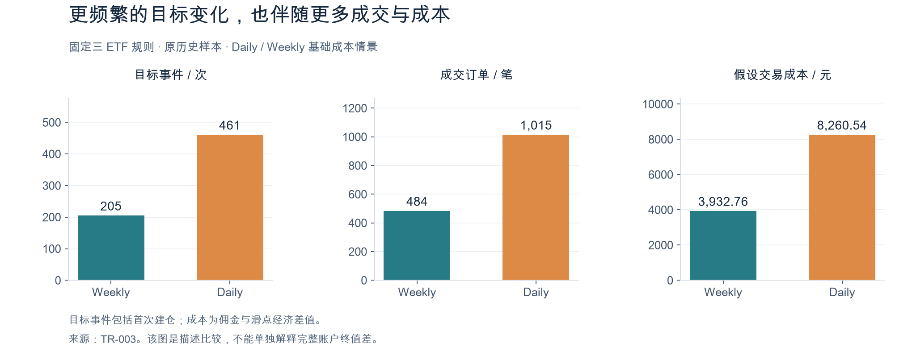

# 日频与周频 ETF 动量比较

[返回项目首页](../../README.md) · [数据与方法](data-and-methods.md) · [关键术语](glossary.md) · [证据索引](evidence/README.md)

研究对象：510300、510500、159915。历史样本：2013-04-19 至 2026-09-15。展示整理日期：2026-10-04。

## 研究问题与比较设计

在相同 ETF 集合、动量窗口、选择规则和执行约定下，每个交易日检查目标与每周检查目标，会产生怎样的账户路径差异？周内目标反复与交易摩擦是否值得进一步研究？

| 约定 | 内容 |
| --- | --- |
| 起点 | 初始资金均为 12,000 元；首次执行日 2013-04-22 |
| 排序 | 20 个实际交易观察日的总回报动量，需 21 个有效观察；分数降序、代码升序解并列 |
| 选择 | Top2；全部分数为负仍选择，不另加趋势过滤器 |
| 目标 | 名单变化时，各以信号日收盘研究权益的 45% 冻结目标金额 |
| 持有 | 名单不变时保持，不因权重漂移或名单内排名互换而调仓 |
| 检查频率 | Daily 每个实际交易日；Weekly 每周最后实际交易日，不硬编码星期五 |
| 执行 | 下一实际交易日原始开盘价，先卖后买，遵守份额与非负现金约束 |
| 基础成本 | 佣金率 0.00012、最低 5 元、单向滑点 0.0003、印花税 0；均为假设成本 |
| 压力成本 | 佣金率、最低佣金和滑点均乘 1.5，其余规则保持 |

总回报指数用于信号；成交和估值使用原始市场价格。账户另行处理分红应收、现金释放及真实份额变动。

## 四个历史情景

| 情景 | 最终权益（元） | 累计净收益 | 最大回撤 | 目标事件 | 成交订单 | 假设总成本（元） |
| --- | ---: | ---: | ---: | ---: | ---: | ---: |
| Daily · 基础成本 | 32,637.51 | +171.9792% | −56.2332% | 461 | 1,015 | 8,260.54 |
| Weekly · 基础成本 | 42,461.21 | +253.8434% | −50.3786% | 205 | 484 | 3,932.76 |
| Daily · 1.5× 成本 | 27,068.21 | +125.5684% | −58.3817% | 461 | 1,010 | 11,879.41 |
| Weekly · 1.5× 成本 | 39,254.82 | +227.1235% | −51.0618% | 205 | 480 | 5,771.98 |

在这四条指定历史路径中，Weekly 终值高于对应 Daily；两组仍均有较大回撤。基础成本下终值差为 9,823.70 元，压力成本下为 12,186.61 元。路径、费用与分红权益共同影响终值，不能只根据总成本差解释收益差。

这些结果尚未证明相对市场基准的超额收益，也不能推出未来周频一定优于日频。[原回放报告](evidence/res_freq_tr_003_screen_2026-09-26.md) · [数值摘要](evidence/res_freq_tr_003_summary_2026-09-26.json)。

## 描述诊断：目标如何反复

Daily 的 461 次目标事件含首次建仓，其余 460 次为后续变化。按下一次更晚的 Weekly 检查点分类，264 次得到确认，143 次回到旧目标，54 次演化为第三种目标。回到旧目标的事件占全部事件的 31.02%。

完整周区间共 687 个，111 个出现目标集合返回此前状态的 A→B→A 型反复，占 16.16%。409 个区间无目标变化，278 个有变化；末尾未完结区间另存并排除。

按冻结的订单形态一对一配对，Daily 有 607 笔成交订单未匹配对应 Weekly 形态。这是订单描述，不能直接当成额外交易导致的终值损失。[描述诊断报告](evidence/res_freq_pm_002a_mechanism_2026-09-27.md)。

## 局部反事实：区分路径与摩擦

每个区间从 Daily 基础成本账户的同一完整状态复制三条分支。起点为上一 Weekly 检查点订单执行日收盘，终点为下一 Weekly 检查点收盘、新信号订单执行之前。

| 分支 | 区间内处理 |
| --- | --- |
| 实际动态换仓 | 复制冻结 Daily 实际订单 |
| 保持持仓 | 不执行周内信号订单，继续处理分红、公司行动与估值 |
| 同数量无摩擦路径 | 复制实际成交日期、方向与数量，按原始开盘价且佣金 / 滑点为零；取消订单仍为零成交 |

每个区间满足：净局部效果 = 摩擦前持仓路径效果 + 交易摩擦效果。共同起点包括可用现金、应收、待可用现金、ETF 份额及已登记分红权益。

| 278 个有变化区间的非复利局部总量 | 元 |
| --- | ---: |
| 净局部效果 | −8,568.70 |
| 摩擦前持仓路径效果 | −2,123.30 |
| 交易摩擦效果 | −6,445.40 |

这是各区间重新出发的局部诊断，不能当成完整 Weekly−Daily 终值差 9,823.70 元的分解。无摩擦分支复制实际数量，也不是重新按无摩擦现金计算的独立可执行策略。

whipsaw 相对非 whipsaw 的有变化区间，其净、路径、摩擦中位差依次为 −31.77、−18.53、−7.09 bps。三个差值分别由各指标中位数计算，不能要求后两个中位差相加等于第一个。[局部反事实报告](evidence/res_freq_pm_002b_pnl_attribution_2026-09-27.md)。

## 样本内统计检查

预定检查使用长度为 8 个完整区间的非循环移动区块自助抽样，共 10,000 次，另做 278 次逐一移除有变化区间的检查。主要结果为 whipsaw 与非 whipsaw 的净局部效果中位差，路径及摩擦为两个次要结果。

| 指标 | 原样本中位差（bps） | 自助抽样 2.5%–97.5% 分位区间（bps） |
| --- | ---: | ---: |
| 净局部效果（主要） | −31.77 | [−40.42, −28.43] |
| 摩擦前路径（次要） | −18.53 | [−28.30, −14.85] |
| 交易摩擦（次要） | −7.09 | [−7.67, −6.14] |

三个分量在 10,000 次重采样及 278 次逐一区间移除中均保持负方向。这支持本样本内机制稳定性；解释依赖区间定义、分组及区块长度，不是样本外置信保证，负方向比例也不是 p 值。[稳健性报告](evidence/res_freq_pm_002c1_robustness_2026-09-28.md)。

阅读提示：1 bps（基点）= 0.01 个百分点，31.77 bps = 0.3177 个百分点。这里比较的是区间局部效果的中位差，不能理解为完整账户累计收益差。[术语与示例](glossary.md)。

## 接下来的证据来自哪里

TEWM-v1 前瞻协议已冻结，Weekly 与 Daily 将从共同起点开始，用冻结规则收集新证据。协议排除冻结前已接触的数据与冻结周，禁止事后补填观察记录；正式审阅门槛为 26 个完整且可评价的周区间。

截至 2026-10-04，账户尚未启动，真实信号与执行均为零。合成测试验证输入时点、账务、不重复执行及中断恢复，不产生真实投资表现。[前瞻协议](evidence/res_freq_oos_001_freeze_2026-10-02.md) · [工程验收](evidence/res_freq_oos_eng_001b_readiness_2026-10-04.md)。

## 适用范围

研究只覆盖三只指定 ETF 与固定规则。Universe 选择、既有研究接触、成本假设、分红现金时点、历史信息未知及时间依赖均限制外推。局部反事实分组不构成对所有日频策略的因果识别。当前没有据此新增排名缓冲阈值、搜索参数或改变正式模拟策略。
